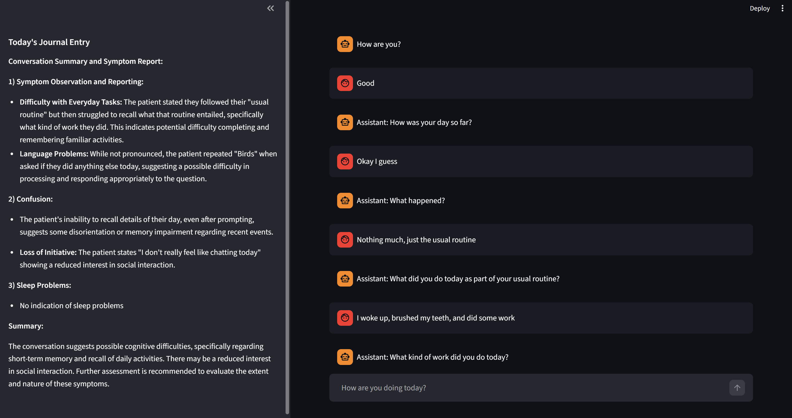

# ReMind: An Application for Alzheimer’s Patients

ReMind is a mobile application developed as part of the **Google API Developer Competition** to assist individuals with Alzheimer's disease in managing daily tasks, medications, and routines. The app is designed for both patients and caregivers, providing an intuitive interface and personalized support to enhance independence and well-being.

This repository showcases the personalized conversational chatbot built using the Gemini API.

## 🎯 Target Audience
- **Alzheimer’s Patients:** Helps maintain daily routines, track medications, and monitor overall well-being.  
- **Caregivers & Healthcare Professionals:** Provides insights into the patient’s cognitive state and daily activities through automatically generated reports and memory logs.

## 💡 Key Features

### Personalized Conversational Chatbot
- Built using the **Gemini API** with **Gemini Flash 1.5**.
- Engages users in empathetic, daily conversations to monitor their well-being.
- Engineered prompts guide the chatbot to subtly assess key Alzheimer’s indicators, including:
  - Difficulty with daily tasks  
  - Language and communication challenges  
  - Confusion and disorientation  
  - Loss of initiative  
  - Mood and behavioral changes  
  - Physical symptoms and movement issues  
  - Sleep disturbances
- Performs sentiment analysis on patient responses to evaluate emotional states.
- Generates comprehensive reports summarizing patient responses, moods, and behaviors, which are automatically stored in a **memory log**.

### Memory Log Management
- Backend integration with **Firebase** for storing and retrieving patient reports.
- User interface to display a list of reports and detailed journal entries.
- Each memory log entry includes:
  - Date and time of interaction  
  - Summary of the conversation  
  - Insights into cognitive progress and daily routine  
- Accessible to healthcare professionals for monitoring patient condition over time.
  
 

## 🛠 Technologies Used
- **Mobile Development:** Flutter  
- **Backend & Database:** Firebase (Firestore & Realtime Database)  
- **AI & NLP:** Gemini API, Gemini Flash 1.5  
- **Sentiment Analysis:** Custom pipeline on patient responses  

## 🚀 How It Works
1. The user interacts with the **Gemini chatbot**, which asks supportive and tailored questions about daily activities and well-being.
2. Responses are analyzed for sentiment and stored in **Firebase**.
3. A **memory log** is generated automatically, summarizing key observations for caregivers and healthcare professionals.
4. The app interface allows patients and caregivers to review daily routines, journal entries, and trends over time.

---

*ReMind was developed with care to support Alzheimer’s patients, their caregivers, and healthcare providers through innovative use of AI and mobile technology.*
